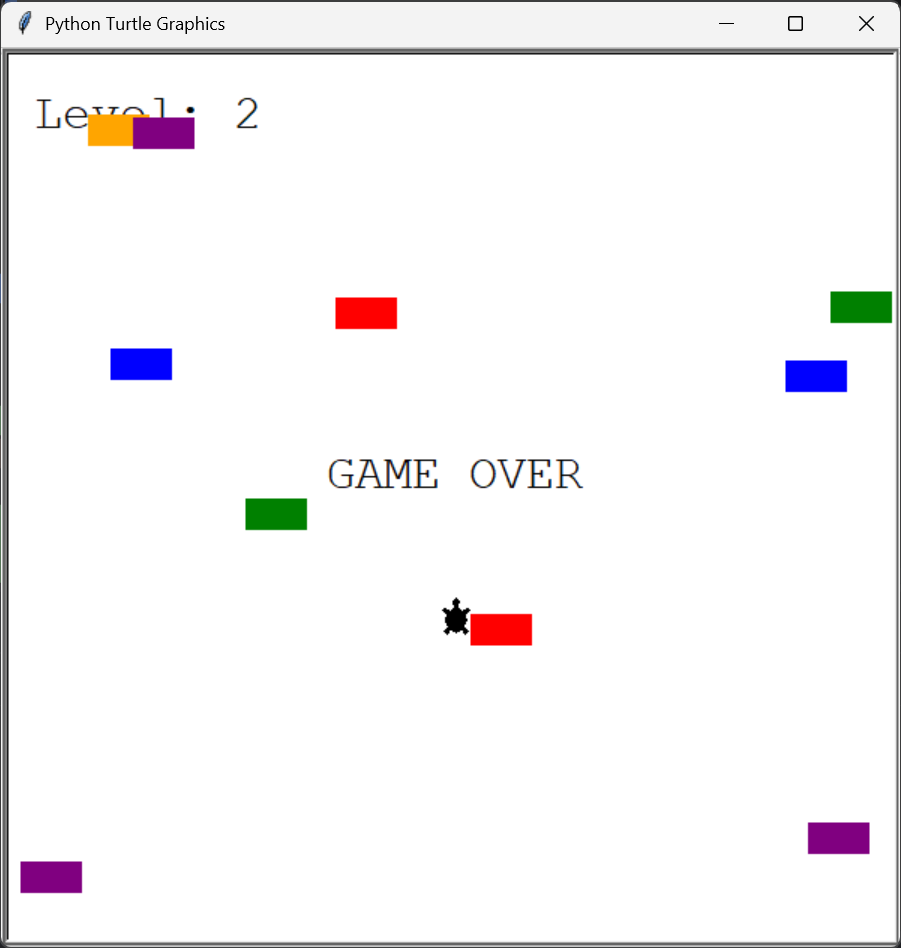

# Turtle Crossing 🚦🐢

A fun Python Turtle game where you guide a turtle across a busy road while dodging moving cars. Each time you reach the finish line, the level increases and the traffic gets faster!

## Features
- Smooth turtle movement with the keyboard.
- Randomly generated cars.
- Collision detection with cars.
- Level-up system after each successful crossing.
- Increasing difficulty as the game progresses.
- Simple score/level display.

## Controls
- Press `Up` to move the turtle forward.

## How to Run
```bash
python main.py
```

## Project Files
- `main.py`
- `player.py`
- `car_mager.py`
- `scoreboard.py`

## Game Goal
Reach the top of the screen without hitting any cars.  
Every successful crossing makes the game harder and more exciting!

## Screenshot




## Built With
- Python
- Turtle graphics
- Object-Oriented Programming

## Author
HeyNia
